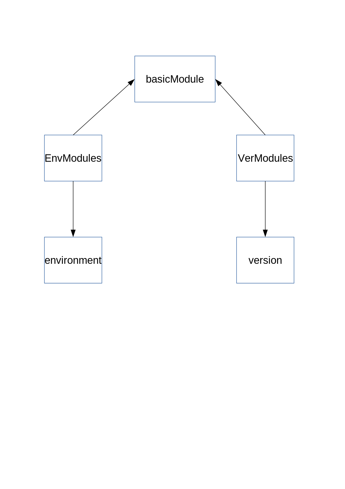

# Django Demo

this demo is a framework for using django to write simple web api server.
notice that this demo get no html page, you can just use this demo save
and get data from the backend database.

# App Config

* `SQLite3`(default), you can set MySQL in `config/globalconf.py`
* `Apps`:
    - BasicMMS
    - VerMS
    - EnvMS
* `JS` libs:
    - JQuery 2
    - BootStrap 3
* `Templates`:
    - basic.html
    - index.html(you may customer your home page here)
* `APIs`:
    - TaskArrangeMS/BasicMMS/
        + ModuleList/
        + newModule/
        + updateModule/
        + deleteModule/
    - TaskArrangeMS/EnvMS/
        + EnvList/
        + EnvDetail/
        + newEnv/
        + updateEnv/
        + deleteEnv/
        + newModule/
        + updateModule/
        + deleteModule/
    - TaskArrangeMS/VerMS/
        + VerList/
        + VerDetail/
        + newVer/
        + updateVer/
        + deleteVer/
        + newModule/
        + updateModule/
        + deleteModule/
* `Logs`, you can config log in `log/logger.cfg`

# Description

you can use the system to manage a real machine config information.

a web server machine can have hardware information and software information:

- ip,port
- git/svn path, rid

support a big web app have three individual child app:

- payment manage system
- customer information manage system
- order manage system

payment,customer,order is the basic module for config the three part of the web.
you can use `BasicMMS` api to manage them.

each app get hardware part like *ip/port/sqlserver*, we can use `EnvMS` to manage them.

the software part is managed by `VerMS` API.

# Data Relation

# Lisence

MIT
